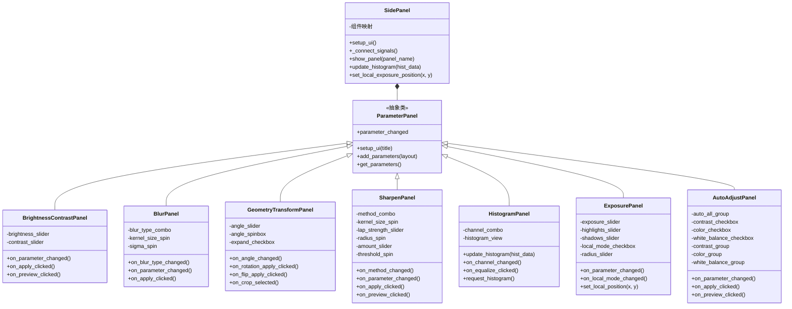
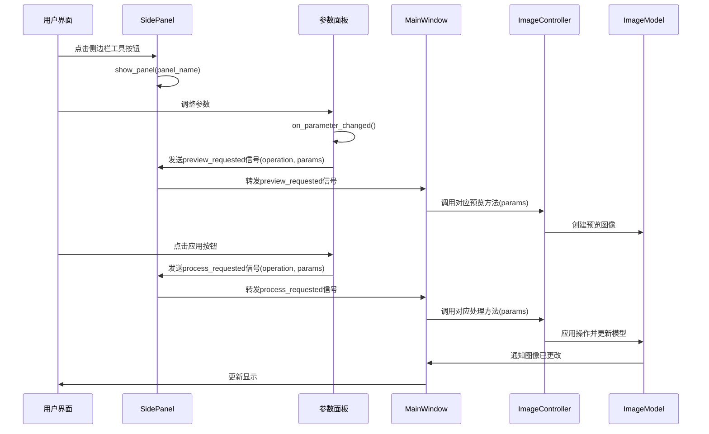

# ImagePro侧边栏功能示意图

以下Mermaid图表展示了ImagePro图像处理软件的侧边栏功能结构和关键函数流程。

## 侧边栏组件结构图



## 侧边栏功能流程图

```mermaid
flowchart TD
    Start[侧边栏按钮点击] --> ShowPanel[SidePanel.show_panel(panel_name)]
    
    ShowPanel --> |brightness_contrast| BC[显示亮度/对比度面板]
    ShowPanel --> |blur| BL[显示模糊处理面板]
    ShowPanel --> |geometry| GE[显示几何变换面板]
    ShowPanel --> |sharpen| SH[显示锐化处理面板]
    ShowPanel --> |histogram| HI[显示直方图面板]
    ShowPanel --> |exposure| EX[显示曝光调整面板]
    ShowPanel --> |auto_adjust| AA[显示智能调整面板]
    
    BC --> BCP[BrightnessContrastPanel参数调整]
    BCP --> |预览| BCPS[preview_brightness_contrast\nbrightness, contrast]
    BCP --> |应用| BCPA[adjust_brightness_contrast\nbrightness, contrast]
    
    BL --> BLP[BlurPanel参数调整]
    BLP --> |高斯模糊| BLG[apply_gaussian_blur\nkernel_size, sigma]
    BLP --> |中值滤波| BLM[apply_median_blur\nkernel_size]
    BLP --> |双边滤波| BLB[apply_bilateral_filter\nd, sigma_color, sigma_space]
    
    GE --> GEP[GeometryTransformPanel参数调整]
    GEP --> |旋转| GER[rotate_image\nangle, scale, expand]
    GEP --> |翻转| GEF[flip_image\nflip_code]
    GEP --> |裁剪| GEC[crop_image\nx, y, width, height]
    
    SH --> SHP[SharpenPanel参数调整]
    SHP --> |拉普拉斯锐化| SHL[apply_laplacian_sharpen\nkernel_size, strength]
    SHP --> |USM锐化| SHU[apply_usm_sharpen\nradius, amount, threshold]
    
    HI --> HIP[HistogramPanel参数调整]
    HIP --> |直方图计算| HIC[calculate_histogram\nchannel, bins, range_values]
    HIP --> |直方图均衡化| HIE[apply_histogram_equalization\nper_channel]
    
    EX --> EXP[ExposurePanel参数调整]
    EXP --> |调整曝光| EXE[adjust_exposure\nexposure]
    EXP --> |调整高光| EXH[adjust_highlights\nhighlights]
    EXP --> |调整阴影| EXS[adjust_shadows\nshadows]
    EXP --> |局部曝光| EXL[adjust_local_exposure\ncenter_x, center_y, radius, strength]
    
    AA --> AAP[AutoAdjustPanel参数调整]
    AAP --> |自动对比度增强| AAC[apply_auto_contrast\nclip_limit, tile_grid_size]
    AAP --> |自动色彩校正| AAR[apply_auto_color\nsaturation_scale, vibrance_scale]
    AAP --> |自动白平衡| AAW[apply_auto_white_balance\nmethod]
    AAP --> |一键优化| AAA[apply_auto_all\ncontrast, color, white_balance]
```

## 信号与槽连接流程



## 功能参数对照表

| 功能名称 | 面板类 | 控制器方法 | 关键参数 |
|---------|--------|-----------|---------|
| 亮度/对比度 | BrightnessContrastPanel | adjust_brightness_contrast | brightness(-100~100), contrast(-100~100) |
| 高斯模糊 | BlurPanel | apply_gaussian_blur | kernel_size(1~31), sigma(0~10) |
| 中值滤波 | BlurPanel | apply_median_blur | kernel_size(1~31) |
| 双边滤波 | BlurPanel | apply_bilateral_filter | d(1~20), sigma_color(1~200), sigma_space(1~200) |
| 旋转 | GeometryTransformPanel | rotate_image | angle(-180~180), scale(0.1~5.0), expand(bool) |
| 翻转 | GeometryTransformPanel | flip_image | flip_code(0,1,-1) |
| 裁剪 | GeometryTransformPanel | crop_image | x, y, width, height |
| 拉普拉斯锐化 | SharpenPanel | apply_laplacian_sharpen | kernel_size(1~31), strength(0.1~3.0) |
| USM锐化 | SharpenPanel | apply_usm_sharpen | radius(1~20), amount(0.1~3.0), threshold(0~50) |
| 直方图计算 | HistogramPanel | calculate_histogram | channel(None,0,1,2), bins(256), range_values(0,256) |
| 直方图均衡化 | HistogramPanel | apply_histogram_equalization | per_channel(bool) |
| 曝光调整 | ExposurePanel | adjust_exposure | exposure(-2.0~2.0) |
| 高光调整 | ExposurePanel | adjust_highlights | highlights(-1.0~1.0) |
| 阴影调整 | ExposurePanel | adjust_shadows | shadows(-1.0~1.0) |
| 局部曝光 | ExposurePanel | adjust_local_exposure | center_x, center_y, radius(10~300), strength(0.1~1.0) |
| 自动对比度增强 | AutoAdjustPanel | apply_auto_contrast | clip_limit(1.0~5.0), tile_grid_size((4,4)~(16,16)) |
| 自动色彩校正 | AutoAdjustPanel | apply_auto_color | saturation_scale(1.0~2.0), vibrance_scale(1.0~2.0) |
| 自动白平衡 | AutoAdjustPanel | apply_auto_white_balance | method('gray_world','perfect_reflectance','adaptive') |
| 一键优化 | AutoAdjustPanel | apply_auto_all | contrast(bool), color(bool), white_balance(bool) | 